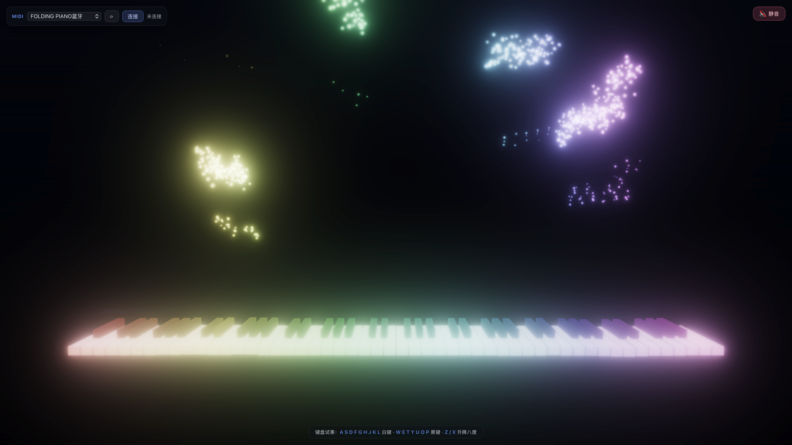

<p align="center">
  <h1 align="center">🎹 VFXPiano</h1>
  <p align="center"><b>把每一次按键，都变成一场烟花。</b></p>
  <p align="center">88 键炫彩钢琴可视化 · MIDI / 键盘演奏 · 三层粒子特效 · 原生低延迟发声</p>
  <p align="center">
    <a href="https://github.com/W-Mai/VFXPiano/releases"></a>
    
    
    
    
  </p>
</p>

<p align="center">
  
</p>

---

## 🎹 这是什么

一个会发光的钢琴。

接上 MIDI 键盘，或者干脆用电脑键盘弹 —— 每按下一个音，那颗琴键就亮起属于它自己的颜色，
一束彩色的烟雾与火花从键面迸射、向夜空升腾；整排琴键像水面一样，随你的指尖荡漾开来。

它不教你弹琴，不是 DAW，也不录音。它只做一件事：**让你的演奏，好看得不像话。**

## ✨ 亮点

- 🌈 **一音一色** —— 低音暖红，高音冷紫，整条键盘铺成一道彩虹光谱。
- 💥 **三层粒子烟花** —— 烟雾缭绕、光球脉动、火花迸射，叠加 Bloom 辉光，按一下就炸开。
- 〰️ **琴键会荡漾** —— 按键的力道化作水波沿键盘向两侧传播，连按同一点波浪越叠越高；松手即归位。
- 🎹 **88 键全尺寸** —— 微 3D 透视，珍珠白与乌黑键面，按下凹陷、泛光。
- 🔊 **原生低延迟** —— 采样 Steinway 音色，MIDI 直达合成引擎，体感与 Logic Pro 同档。
- ⌨️ **没 MIDI 也能玩** —— 电脑键盘就是琴键。

## 🎬 怎么玩

| 按键 | 作用 |
|---|---|
| <kbd>A</kbd> <kbd>S</kbd> <kbd>D</kbd> <kbd>F</kbd> <kbd>G</kbd> <kbd>H</kbd> <kbd>J</kbd> <kbd>K</kbd> <kbd>L</kbd> | 白键（C–E） |
| <kbd>W</kbd> <kbd>E</kbd> <kbd>T</kbd> <kbd>Y</kbd> <kbd>U</kbd> <kbd>O</kbd> <kbd>P</kbd> | 黑键 |
| <kbd>Z</kbd> / <kbd>X</kbd> | 升 / 降八度 |
| MIDI 设备 | 左上角选设备 → 连接，开弹 |

> 💡 弹一首《天空之城》或《Unravel》试试效果 🌌

## 📦 下载

到 [Releases](https://github.com/W-Mai/VFXPiano/releases) 下载对应平台的安装包，音源已内置，**离线即可使用**。

## 🔧 从源码运行

```bash
pnpm install
pnpm tauri dev
```

需要 Node + pnpm + Rust 工具链。

## 📄 许可

MIT
